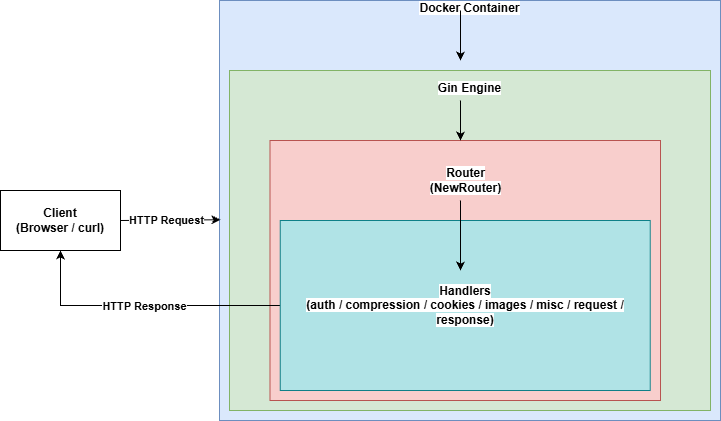

# HTTPBin Clone (Go + Gin)

This project is a clone of the popular **httpbin.org** service, implemented in **Go** using the **Gin web framework**.

My main goals of creating this project are:
- Understanding the HTTP protocol in depth
- Learning request / response mechanics
- Practicing streaming, compression, authentication, cookies, and headers
- Writing testable and well-structured backend code
- Improving my Go skills.

---

## Features

### Authentication
- Basic Authentication
- Hidden Basic Authentication
- Bearer Authentication
- Digest Authentication

### Response Endpoints
- `/status/:code`
- `/bytes/:n`
- `/cache/:n`
- `/delay/:n`
- `/drip`
- `/range/:n`
- `/redirect/:n`
- `/relative-redirect/:n`
- `/absolute-redirect/:n`
- `/stream/:n`

### Request Inspection
- `/anything`
- `/get`
- `/headers`
- `/ip`
- `/methods`
- `/user-agent`

### Cookies
- `/cookies`
- `/cookies/set/:name/:value`
- `/cookies/delete`

### Compression
- `/gzip`
- `/brotli`
- `/deflate`

### Images
- `/image/jpeg`
- `/image/png`
- `/image/svg`
- `/image/webp`

### Miscellaneous
- `/deny`
- `/forms/post`
- `/html`
- `/json`
- `/links`
- `/robots.txt`
- `/uuid`
- `/xml`

---

## Technologies Used

- Go
- Gin Web Framework
- net/http
- httptest (for testing)
- gzip / brotli / deflate compression
- UUID (RFC 4122)

---

## Running the Project (Without Docker)
## Requirements

- Go 1.23+

## Run locally
`go run ./cmd`

- Default port: 8080

To change the port:

`PORT=9000 go run ./cmd/api`

## Running with Docker (Recommended)
## Requirements

- Docker Desktop

## Build the Docker image
`docker build -t httpbin-clone .`

## Run the container
`docker run -p 8080:8080 httpbin-clone`

The service will be available at:

http://localhost:8080

---

### Running Tests
All handlers are covered with tests. Run all tests with:

`go test ./...`

## Project Structure

```text
cmd/
 └──  main.go
internal/
 ├── router/
 │    └── router.go
 └── handlers/
      ├── auth/
      ├── request/
      ├── response/
      ├── compression/
      ├── images/
      ├── cookies/
      └── misc/
```
---
## Architecture Overview




### Purpose

I made this project to learn HTTP fundamentals and improve my Go language skills.

### Notes

- This project is intended for educational purposes.
- Code prioritizes readability and correct HTTP semantics (did my best).
- All handlers are covered with tests where applicable.
- Inspired by https://httpbin.org